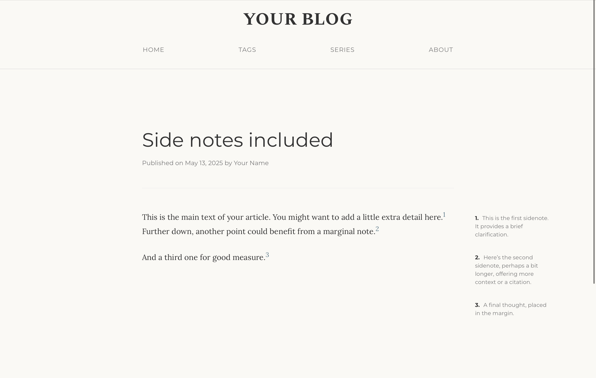

# Blog Template

Kinfolk inspired blog template using [Astro](https://astro.build/).

# Installation

1. Install [pnpm](https://pnpm.io/installation) or any other package manager.
2. Clone this repository.
3. Run `pnpm install` to install dependencies.

# Instructions

1. Check for `TODO`s in the code and change them. [Ripgrep](https://github.com/BurntSushi/ripgrep) or regular `grep` may be helpful here.
2. Change `Your Name` and `Your Blog` in code. [Fastmod](https://github.com/facebookincubator/fastmod) may be helpful here.
3. Change "About" page at `src/pages/about.astro`.
4. Check out locally using `pnpm dev --host`. Omit host if just testing locally.
5. Delete sample posts. `pnpm clear-posts`.
6. Create new posts using `pnpm new-post`.

# To update template

This assumes that you do not have any local code changes to the template.

1. Add and commit and local changes.
2. Export your content for safety. `pnpm run export-posts`.
3. Add the upstream (one-time setup). `git remote add template_upstream git@github.com:emintham/blog-template.git`.
4. Verify the upstream. `git remote -v`.
5. Fetch the upstream. `git fetch template_upstream`.
6. Merge the upstream. `git merge template_upstream/master`.
7. Resolve any merge conflicts.
8. Re-run `pnpm install` to update dependencies.
9. Test the site locally. `pnpm dev --host`.
10. If recovery is needed, use `pnpm clear-posts` and `pnpm import-posts` to restore your content.

# Features

