# Kinfolk Inspired Astro Blog Template

An Astro blog template focused on minimalism and typography, inspired by Kinfolk magazine.
Ideal for writers, developers, and knowledge curators seeking a serene reading experience
and tools for a personal blog or Second Brain.

[Live Demo](https://emintham.com)
[Changelog](https://github.com/emintham/blog-template/blob/master/CHANGELOG.md)

## Core Features

- **Minimalist & Elegant Design:** Clean, spacious, and typography-centric, inspired by Kinfolk.
- **Astro Powered:** Leverages Astro for a fast, modern, and content-focused experience.
- **Responsive Layout:** Adapts gracefully to all screen sizes, ensuring a great reading experience on any device.
- **SEO Friendly:** Includes structural SEO enhancements and automatic sitemap generation.
- **Optimized Images:** Script for WebP conversion, resizing, and responsive delivery via `<picture>` element.
- **Homepage:** Displays recent posts with previews.
  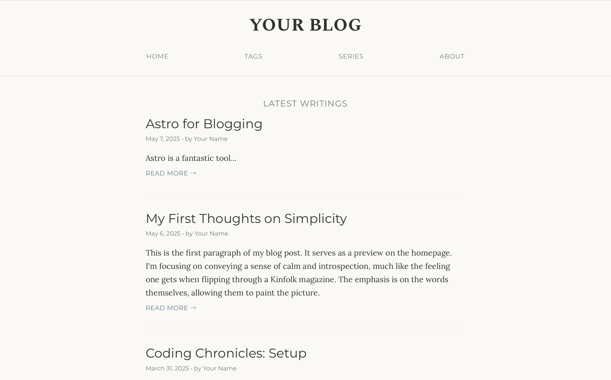

## Advanced Content & Knowledge Management

Offers advanced features for knowledge organization and curation:

- **Multiple Post Types:**

  - **Standard Posts:** For traditional, long-form blog articles.
  - **Fleeting Thoughts:** Short-form posts for quick insights, fully displayed in previews.
    
  - **Book Notes:** In-depth format for book reviews, summaries, and quotes, aiding personal knowledge base construction.
    - **Detailed Display:** Rich presentation with book cover, author details, review, and collapsible quotes section.
      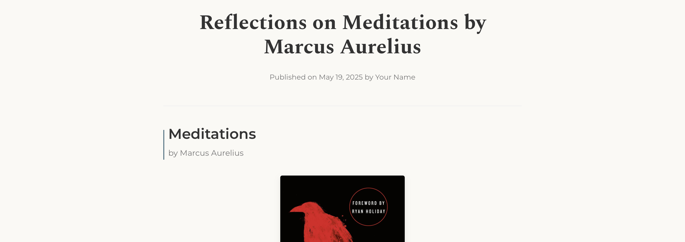
    - **Organized Quotes:** Quotes in separate YAML files with dedicated tags for easy management.
      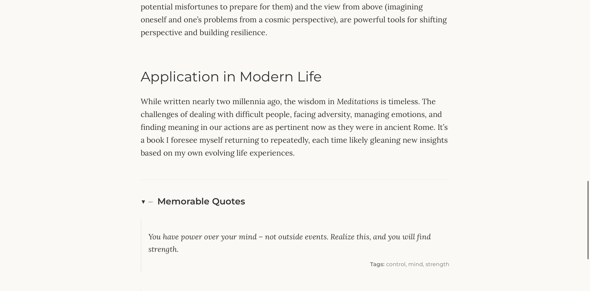
    - **Dedicated Tagging Systems:**
      - **Book Tags:** Categorize books by genre, theme, etc. (e.g., "non-fiction", "philosophy").
        
        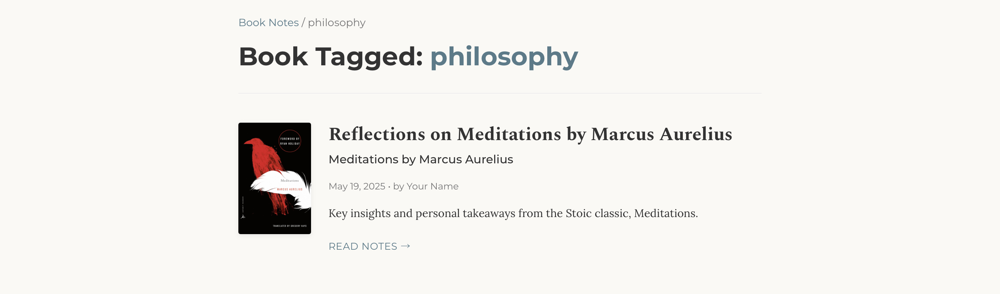
      - **Quote Tags:** Tag individual quotes for easy retrieval and cross-referencing (e.g., "leadership", "mindfulness").
        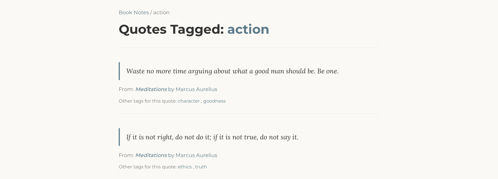
    - **Preview Cards:** Distinct preview style for book notes in listings.
      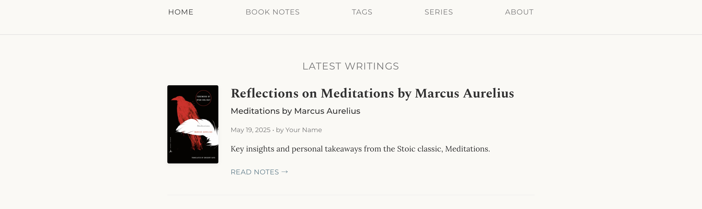

- **Taxonomies & Organization:**

  - **General Tags Page:** Automatically generated page listing all general post tags with post counts (`/tags/`).
    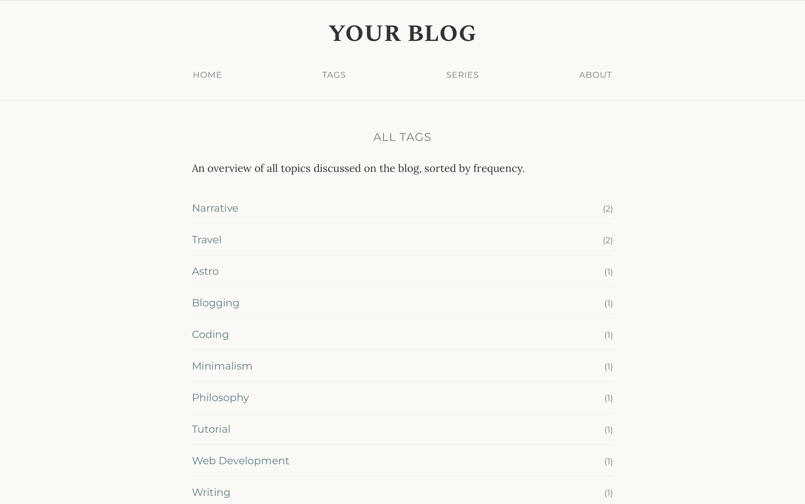
  - **Series Page:** Group related posts into series, each with its own dedicated page and chronological listing (`/series/`).
    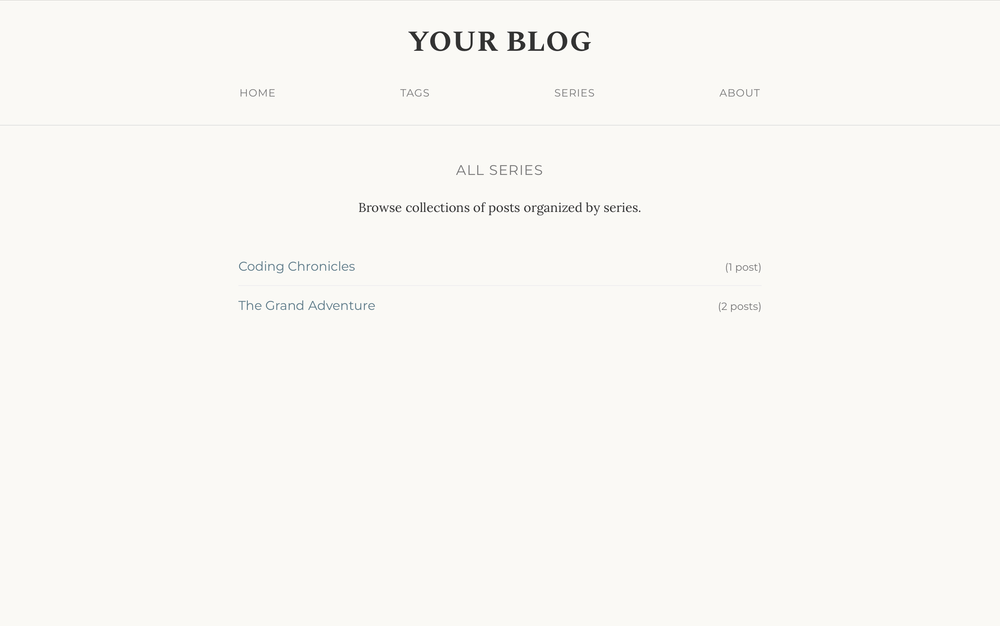

- **Sidenotes / Marginalia:**

  - Tufte-style sidenotes (margin notes on wide screens, footnotes on small screens).
  - Supports numbered `[^1]` and named `[^my-note]` footnotes for clarity.
    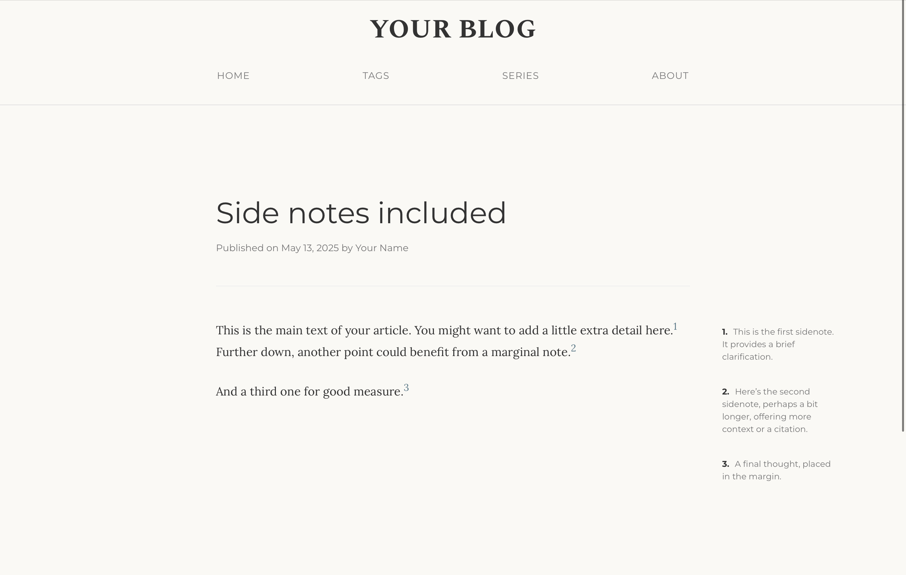
    _Example Markdown for Sidenotes:_

    ```markdown
    This is some text using a numbered footnote.[^1] This text uses a named footnote.[^my-memorable-note]

    [^1]: This is the first sidenote, using a number.

    [^my-memorable-note]: This is the second one, referenced by a name. This can be helpful for managing many footnotes.
    ```

- **Authoring Tools in Dev Mode:**

    - Live previews and hot reloading via Astro's dev server.
      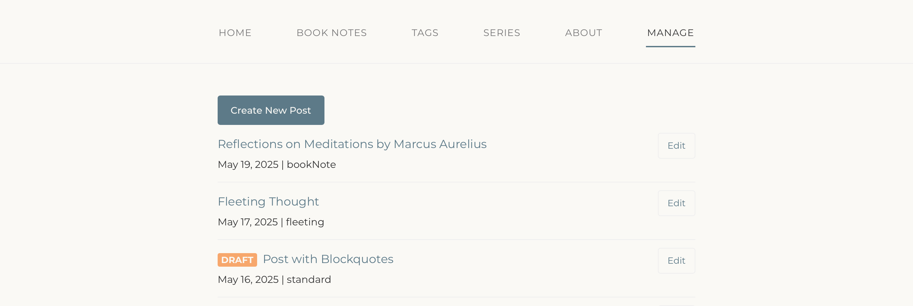
    - Interactive dropdown menus for quick tagging.
      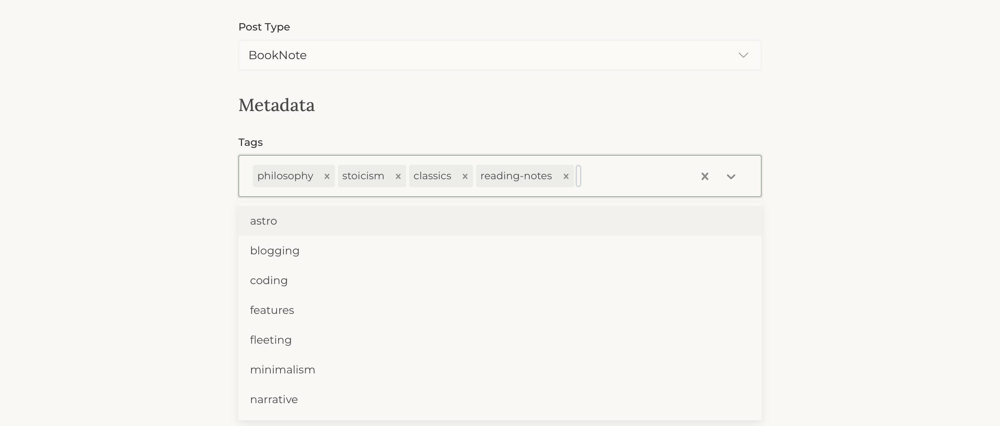

## Prerequisites

- [Node.js](https://nodejs.org/) (LTS version recommended, check Astro's current requirements)
- [pnpm](https://pnpm.io/installation) (This template uses `pnpm` for package management)
- `sharp` and `glob` (installed via `pnpm install` if listed in `package.json`).

## Getting Started

1.  **Use This Template:**

    - Click the green "**Use this template**" button on the [GitHub repository page](https://github.com/emintham/blog-template).
    - Or, clone the repository: `git clone https://github.com/emintham/blog-template.git your-blog-name`
    - Navigate into your new project directory: `cd your-blog-name`

2.  **Install Dependencies:**

    ```bash
    pnpm install
    ```


3.  **Initial Configuration (Important TODOs):**

    - **Site URL:** Open `astro.config.mjs` and set the `site` property to your blog's final URL (e.g., `site: 'https://your-domain.com',`). This is crucial for SEO and sitemap generation.
    - **Site Name & Author Details:** Modify `src/siteConfig.ts` to match your details.
    - **About Page:** Customize the content in `src/pages/about.astro`.
    - **Favicon & Public Assets:** Replace `public/favicon.svg` with your own. Update other assets in `public/` as needed.
    - **Image Source Directory:** Create `images/originals/` in project root for your original images.

4.  **Clear Example Content (Optional):**
    The template may include example posts and quote files. To remove them:
    ```bash
    pnpm run clear-posts
    ```
    _(Clears `src/content/blog/` and `src/content/bookQuotes/`.)_

## Development Workflow

1.  **Start the Dev Server:**

    ```bash
    pnpm run dev
    ```

    Access your site at `http://localhost:4321`. For access from other devices on your network:

    ```bash
    pnpm run dev --host
    ```

2.  **Image Processing:**

    - Place your original high-resolution images (JPG, PNG) in the `images/originals/` directory at the root of your project.
    - Run the image processing script to generate optimized WebP versions and responsive sizes:
      ```bash
      pnpm run img
      ```
    - Processed images are saved to `public/images/processed/`. Run when new/changed originals are added.

3.  **Content Creation:**
    New content (Standard Posts, Fleeting Thoughts, Book Notes) can be created via the admin interface in development mode (e.g., `/admin/create-post`).
    This interface provides fields for all post types, including specific sections for book details and inline quote management for Book Notes.

    **Publishing:** All new content defaults to `draft: true`. Change to `draft: false` in the Markdown frontmatter (or via the admin edit interface) to publish.

4.  **Linting & Formatting:**
    - Apply formatting: `pnpm run format`
    - Check for lint errors: `pnpm run lint`
    - Attempt to auto-fix lint errors: `pnpm run lint:fix`

## Deployment

This Astro blog is a static site, ready for deployment on platforms like Cloudflare Pages, Vercel, Netlify, or GitHub Pages. Connect your Git repository to your chosen platform for automatic builds and deployments. Remember to include the `public/images/processed/` directory in your deployment.

## Updating from the Original Template

If this template repository receives updates, you can merge them into your project. This requires understanding Git, especially merge conflict resolution.

**Before You Update:**

1.  Commit all your local changes: `git add . && git commit -m "My work before updating template"`
2.  (Recommended) Export your content: `pnpm run export-posts`
    (Backs up content to `.exported-content/`)

**Update Process:**

1.  Add Template as Upstream (One-time setup, replace URL):
    ```bash
    git remote add template_upstream git@github.com:emintham/blog-template.git
    ```
    Verify with `git remote -v`.
2.  Fetch Latest Template Changes: `git fetch template_upstream`
3.  Merge Template (ensure you're on your main branch): `git merge template_upstream/master`
4.  **Resolve Merge Conflicts:**
    - **Content Files (`src/content/...`):** Almost always keep **your version**.
    - **Template Code Files (Layouts, Components, etc.):** Manually resolve if you've modified them; otherwise, the template's version is often safe.
    - Use `git status`, edit files, `git add <resolved_file>`, then `git commit`.
    - If stuck, `git merge --abort` cancels the merge.
5.  Install/Update Dependencies: `pnpm install` (if `package.json` or lockfile changed).
6.  Test Thoroughly: `pnpm run dev`.
7.  Content Recovery (If needed): If content was affected, clean up/reset the `src/content/...` directories, then restore from backup using `pnpm run import-posts`.

## Customization

- **Colors & Fonts:** Edit CSS variables in `src/styles/global.css`.
- **Layouts & Components:** Modify Astro components in `src/layouts/` and `src/components/`. Be mindful of potential merge conflicts with future template updates.

## License

This project is licensed under the MIT License.
